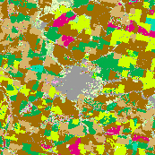
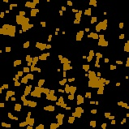

# CroplandCROS Noise Correction Algorithm
Gavin Haynes, Ibrahim Monsour

CS360 Databse Systems

Fall 2024

## Overview
A pipeline to reduce noise from samples of the CroplandCROS dataset which utilizes K Mean Clustering, Normalization, 
Morphological Open and Close operations to extract dominant colors, split, reduce background splatters, and then fill holes.

## Pipeline Structure

_Example input_

### 1. K Mean Clustering
Find the dominant colors in the input sample.

### 2. Projection & Normalization

Take all least dominant colors and normalize with the most dominant ones, and split by color.

### 3. Morphological Operations

Close small holes and remove small groups of noise.

### 4. Result
Take corrected, seperated inputs and combine to form the output.