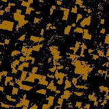

# CroplandCROS Noise Correction Algorithm
Reduce and correct noise in samples of CroplandCROS dataset.

## Dependencies
* Python 3
* OpenCV 2
    * NumPy

## Setup   
This project relies on OpenCV Python, which can be installed via:
```
python pip install opencv-python
```

## Running
Once this repository has been cloned, test this pipeline on one of several test inputs, which are seperated in to small, medium, and large formats. Example: 
```
python main.py input/lg/3.jpg
```

## Pipeline Structure


_Example input_

### 1. K Mean Clustering
Find the dominant colors in the input sample.

### 2. Projection & Normalization



Take all least dominant colors and normalize with the most dominant ones, and split by color.

### 3. Morphological Operations


Close small holes and remove small groups of noise.

### 4. Result
Take corrected, seperated inputs and combine to form the output.

## Authors
[Gavin Haynes](https://github.com/gavinsh32)

[Ibrahim Monsour](https://github.com/mans5834)

## References
* [Image Filtering with OpenCV](https://docs.opencv.org/4.x/d4/d86/group__imgproc__filter.html)

## License
Copyright [2024] [Gavin Haynes, Ibrahim Monsour]

Licensed under the Apache License, Version 2.0 (the "License");
you may not use this file except in compliance with the License.
You may obtain a copy of the License at

http://www.apache.org/licenses/LICENSE-2.0

Unless required by applicable law or agreed to in writing, software
distributed under the License is distributed on an "AS IS" BASIS,
WITHOUT WARRANTIES OR CONDITIONS OF ANY KIND, either express or implied.
See the License for the specific language governing permissions and
limitations under the License.
